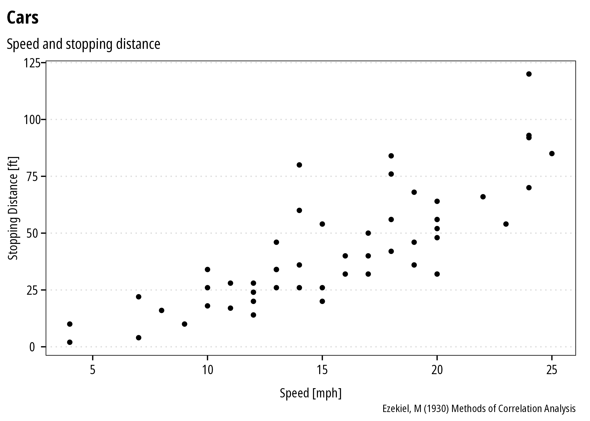

<!-- README.md is generated from README.Rmd. Please edit that file -->

# mpsTemplates

<!-- badges: start -->

[](https://choosealicense.com/)
<!-- badges: end -->

``` r
library(ggplot2)
library(mpsTemplates)
ggplot(cars) +
  geom_point(aes(speed, dist)) +
  theme_mps_noto() +
  labs(title = "Cars", subtitle = "Speed and stopping distance",
       caption = "Ezekiel, M (1930) Methods of Correlation Analysis",
       x = "Speed [mph]",
       y = "Stopping Distance [ft]")
```



## pkgdown

add/edit \_pkgdown.yaml in the package root directory:

``` yaml
template:
  package: mpsTemplates
  bootstrap: 5

navbar:
  type: light
  bg: light
  structure:
    right: [search, github]
```

add the following to the DESCRIPTION:

    Config/Needs/website: mps9506/mpsTemplates
